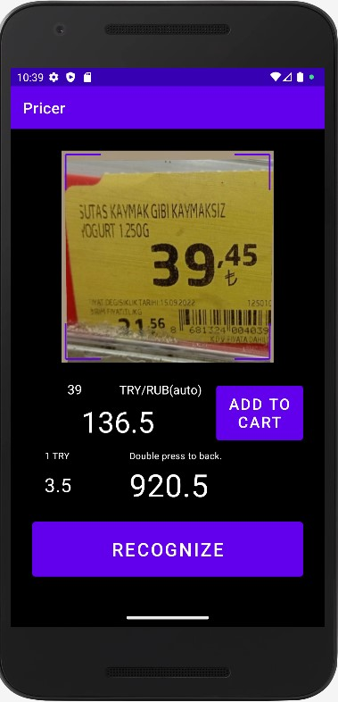

# Pricer
An android application for on-device recognizing the price value on printed store price tags, converting them into the selected currency and saving them in the shopping cart.

The main specifics of the model that implemented in the application are described in related projects:
[Custom YOLOv5](https://github.com/Gainward777/yolov5)
and
[YOLO custom training](https://github.com/Gainward777/yolov5_custom_training)

